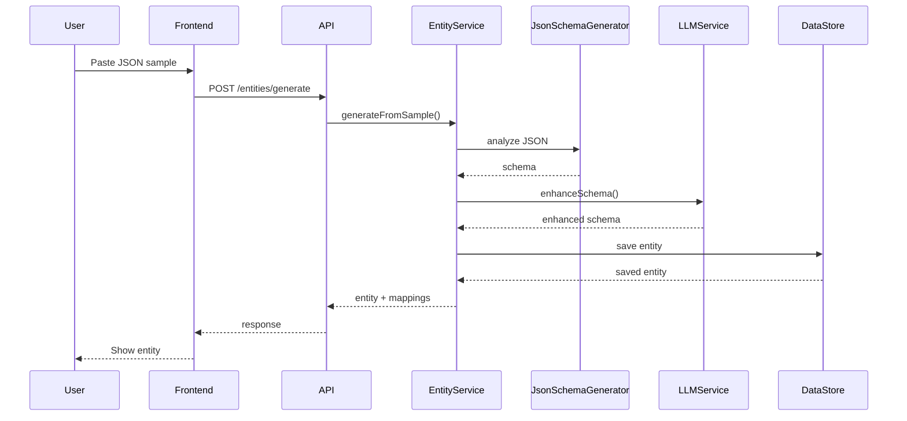
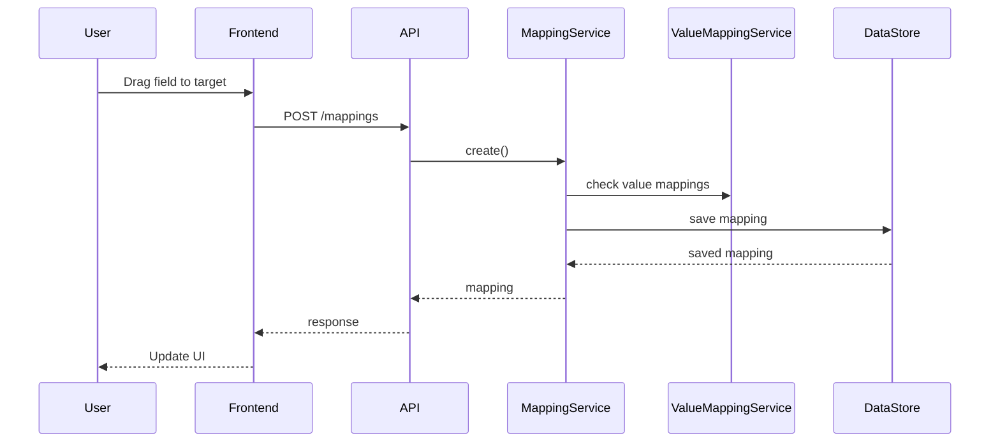
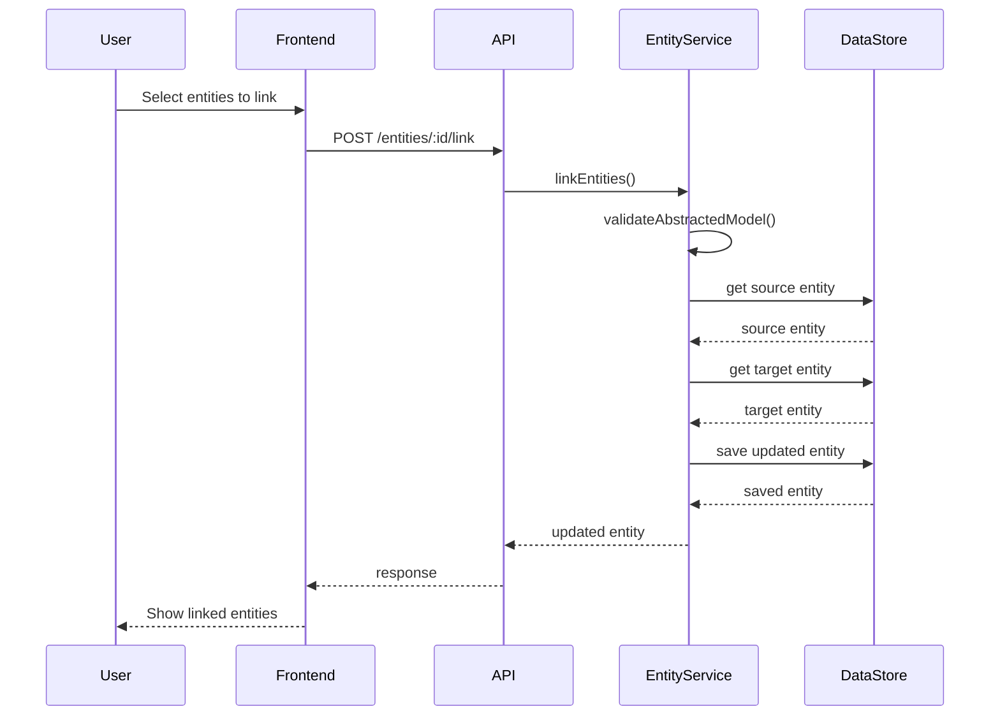
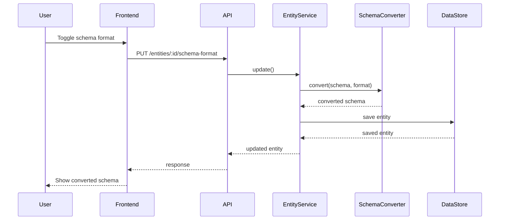
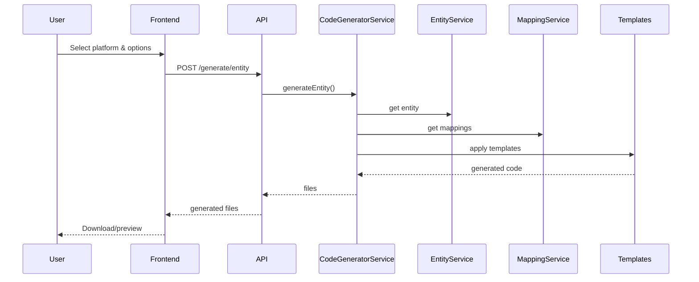

# JsonMapper Architecture

## System Overview

JsonMapper is built as a modern web application with a clear separation between frontend and backend, using TypeScript throughout for type safety.

```
┌─────────────────┐     ┌─────────────────┐     ┌─────────────────┐
│   React UI      │────▶│   Express API   │────▶│  Data Storage   │
│   (Frontend)    │     │   (Backend)     │     │  (JSON Files)   │
└─────────────────┘     └─────────────────┘     └─────────────────┘
         │                       │                       │
         │                       ▼                       │
         │              ┌─────────────────┐             │
         └─────────────▶│   LLM Service   │◀────────────┘
                        │   (OpenAI)      │
                        └─────────────────┘
```

## Component Architecture

### Frontend (React + TypeScript)

```
frontend/
├── src/
│   ├── pages/              # Page components
│   │   ├── Dashboard       # Main overview
│   │   ├── EntityEditor    # Entity management
│   │   ├── MappingEditor   # Visual mapping
│   │   ├── ValueMappingEditor  # Value mappings
│   │   └── CodeGenerator   # Code generation
│   ├── components/         # Reusable components
│   │   ├── Layout         # App layout
│   │   ├── SchemaTree     # Schema visualization
│   │   ├── MappingList    # Mapping display
│   │   ├── MappingDetails # Mapping editor
│   │   └── entity/        # Entity-specific components
│   │       ├── AbstractedFlag      # Abstraction controls
│   │       ├── AbstractedFlagsGroup # Grouped abstraction settings
│   │       └── SchemaFormatToggle  # JSON/YAML toggle
│   └── services/          # API communication
│       └── api.ts         # API client
```

### Backend (Express + TypeScript)

```
src/
├── api/                   # REST endpoints
│   ├── entity-controller  # Entity CRUD + abstraction features
│   ├── mapping-controller
│   ├── value-mapping-controller
│   ├── abstracted-model/  # Abstracted model endpoints
│   │   └── controller.ts
│   └── code-generator-controller
├── services/              # Business logic
│   ├── entity.service     # Entity management + linking
│   ├── mapping.service
│   ├── value-mapping.service
│   ├── llm.service
│   └── code-generator.service
├── utils/                 # Utilities
│   ├── json-schema-generator
│   ├── mapping-validator
│   └── yaml-utils.ts      # YAML conversion utilities
├── storage/               # Data persistence
│   └── data-store
└── types/                 # TypeScript types
    └── index.ts           # Enhanced with abstraction types
```

## Data Flow

### 1. Entity Creation Flow



### 2. Mapping Creation Flow



### 3. Entity Linking Flow



### 4. Schema Format Conversion Flow



### 5. Code Generation Flow



## Key Design Patterns

### 1. Service Layer Pattern
All business logic is encapsulated in service classes, keeping controllers thin:

```typescript
export class MappingService {
  async applyMapping(data: any, mapping: Mapping): Promise<any> {
    // Business logic here
  }
}
```

### 2. Repository Pattern
Data access is abstracted through the DataStore class:

```typescript
export class DataStore {
  async save<T>(data: T): Promise<T> {
    // Persistence logic
  }
}
```

### 3. Strategy Pattern
Different transformation types use strategy pattern:

```typescript
switch (mapping.transformation) {
  case 'direct': return this.directTransform(value);
  case 'template': return this.templateTransform(value);
  case 'value-mapping': return this.valueMappingTransform(value);
}
```

### 4. Template Pattern
Code generation uses template pattern with Handlebars:

```typescript
const template = Handlebars.compile(templateString);
return template(context);
```

### 5. Abstract Factory Pattern
Schema format handling uses abstract factory pattern:

```typescript
const schemaHandler = schemaFormat === 'yaml' ? 
  new YamlSchemaHandler() : new JsonSchemaHandler();
return schemaHandler.parse(schemaData);
```

### 6. Composite Pattern
Entity linking uses composite pattern for relationship graphs:

```typescript
class EntityNode {
  linkedEntities: EntityNode[] = [];
  
  addLink(entity: EntityNode, type: LinkType) {
    this.linkedEntities.push(entity);
  }
  
  traverseLinks(callback: (entity: EntityNode) => void) {
    callback(this);
    this.linkedEntities.forEach(e => e.traverseLinks(callback));
  }
}
```

## Security Considerations

### Input Validation
- All API inputs are validated using TypeScript types
- JSON schemas validate entity structures
- Custom functions are sandboxed

### Authentication (Future)
- JWT-based authentication planned
- Role-based access control
- API key management

### Data Security
- Environment variables for sensitive data
- No credentials in code
- Secure LLM API communication

## Performance Optimizations

### Caching
- In-memory caching for frequently accessed data
- Template compilation caching
- LLM response caching

### Lazy Loading
- Frontend routes are lazy loaded
- Large JSON files streamed
- Pagination for lists

### Async Operations
- All I/O operations are async
- Non-blocking file operations
- Concurrent mapping processing

## Scalability Considerations

### Horizontal Scaling
- Stateless API design
- File-based storage can be replaced with databases
- Load balancer compatible

### Vertical Scaling
- Efficient memory usage
- Stream processing for large files
- Worker threads for CPU-intensive tasks

## Testing Strategy

### Unit Tests
- Service layer methods
- Utility functions
- Data transformations

### Integration Tests
- API endpoints
- Database operations
- File system operations

### E2E Tests (Future)
- User workflows
- Cross-browser testing
- Performance testing

## Deployment Architecture

### Development
```
Local Machine
├── Backend (port 3000)
├── Frontend (port 5173)
└── File Storage (./data)
```

### Production
```
Cloud Provider
├── Container/VM
│   ├── Node.js Server
│   ├── Static Files
│   └── File Storage
├── Load Balancer
├── CDN (static assets)
└── Monitoring
```

### Docker Deployment
```dockerfile
# Multi-stage build
FROM node:18 AS builder
# Build steps...

FROM node:18-alpine
# Production image...
```

## Monitoring & Logging

### Application Metrics
- Request/response times
- Error rates
- Resource usage

### Business Metrics
- Entity creation rate
- Mapping success rate
- Code generation usage

### Logging Strategy
- Structured logging (JSON)
- Log levels (debug, info, warn, error)
- Correlation IDs for tracing

## Future Architecture Considerations

### Microservices
- Separate code generation service
- Independent LLM service
- Dedicated file storage service

### Event-Driven
- Message queue for async processing
- Event sourcing for mapping history
- Real-time updates via WebSocket

### Cloud-Native
- Kubernetes deployment
- Service mesh for communication
- Cloud-native storage solutions

---

*This architecture document is a living document and will be updated as the system evolves.*
